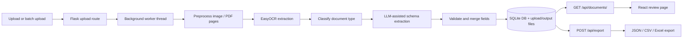

# AI Document Processor

Full-stack document processing app built with Flask, EasyOCR, OCR preprocessing, LLM-assisted extraction, and a React/Vite review UI.

## Stack

- Backend: Flask, SQLAlchemy, EasyOCR, OpenCV, PyMuPDF, Pillow, openpyxl, LLM providers
- Frontend: React 18, Vite, Tailwind CSS, react-dropzone, react-zoom-pan-pinch, TanStack Table, Recharts, react-hot-toast

## Setup

### 1. Backend environment

Create and activate a Python virtual environment, then install the backend dependencies:

```bash
pip install -r backend/requirements.txt
```

EasyOCR downloads its model files on first run, so the initial OCR call may take longer than later runs. The default pipeline does not require a separate Tesseract install.

If you want the OCR stack to work with the default configuration, make sure these packages are available:

- `easyocr`
- `opencv-python-headless`
- `pymupdf`
- `Pillow`
- `flask-sqlalchemy`

### 2. Environment variables

Copy your `.env.example` to `.env` and set the LLM credentials:

```env
LLM_PROVIDER=openai
LLM_MODEL=gpt-4o
LLM_API_KEY=your_api_key_here
```

Optional settings include `DATABASE_URL`, `UPLOAD_FOLDER`, `OUTPUT_FOLDER`, `MAX_UPLOAD_SIZE_MB`, and `PDF_MAX_PAGES`.

### 3. Frontend environment

Install the frontend dependencies and start the Vite dev server:

```bash
cd frontend
npm install
npm run dev
```

### 4. Run the backend

Start the Flask app from the backend folder:

```bash
cd backend
flask run
```

## Architecture Overview



The pipeline runs in `backend/services/document_pipeline.py`. Uploaded files are saved under `uploads/`, processed pages and exports are written to `outputs/`, and the review UI reads the document payload from `GET /api/documents/<id>`.

## Review UI Screenshots

Add review screenshots under `docs/screenshots/` and update the image paths below if you want them rendered in GitHub or VS Code markdown.

### Bounding boxes on document preview


### Corrected fields and extracted tables


## Supported Document Types

| Type | Example sample file | Typical corrected output |
| --- | --- | --- |
| Invoice | `invoice_tcs_march.pdf` | `invoice_number`, `invoice_date`, `vendor_name`, `subtotal`, `tax`, `total`, line-item table |
| Receipt | `reliance_receipt_01.jpg` | `receipt_number`, `date`, `merchant`, `total_amount`, item table |
| Business Card | `infosys_businesscard.png` | `full_name`, `job_title`, `company`, `email`, `phone` |
| ID Card | `employee_id_rahul.jpg` | `full_name`, `id_number`, `date_of_birth`, `department` |
| Contract | `contract_keystone.pdf` | `party_a`, `party_b`, `effective_date`, `term`, clause summary table |
| Form | `form_onboarding.pdf` | `form_title`, `applicant_name`, contact fields, label/value table |
| Handwritten | `handwritten_note_01.jpg` | short note text, reminder time, free-form text block |
| Report | `report_q1_2026.pdf` | `title`, `period`, `author`, `total_revenue`, summary metrics table |

## Sample Extraction Results

- Invoice: `TCS/INV/2026/0312`, `Tata Consultancy Services`, `₹1,24,500.00`
- Receipt: `RR/2026/004`, `Reliance Retail`, `₹2,450.00`
- Business Card: `Amit Sharma`, `Infosys Ltd`, `amit.sharma@infosys.com`
- ID Card: `Rahul Verma`, `INF-4521`, `1998-08-14`
- Contract: `Keystone Solutions Pvt Ltd`, `Acme Retail Group`, `2026-05-01`
- Form: `SHELLEY FRANCIS`, `BARISTA`, `AP14262D`
- Handwritten note: `Call back tomorrow`, `6 PM`
- Report: `Q1 Financials`, `Jan - Mar 2026`, `₹18.2M`

## Key Endpoints

- `POST /api/upload`
- `POST /api/upload/batch`
- `POST /api/classify`
- `POST /api/extract`
- `GET /api/documents`
- `GET /api/documents/<id>`
- `POST /api/export`
- `GET /api/batch/<id>/status`
- `GET /api/stats`
- `GET /api/health`
